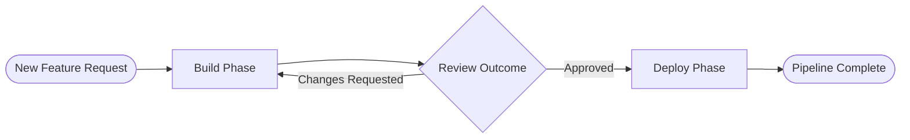

# Developer Pipeline Kanban — Decision Map

```mermaid
flowchart LR
    START(["New Feature Request"]) --> BUILD["Build Phase"]
    BUILD --> REVIEW{"Review Outcome"}
    REVIEW -->|"Approved"| DEPLOY["Deploy Phase"]
    REVIEW -->|"Changes Requested"| BUILD
    DEPLOY --> DONE(["Pipeline Complete"])
```
