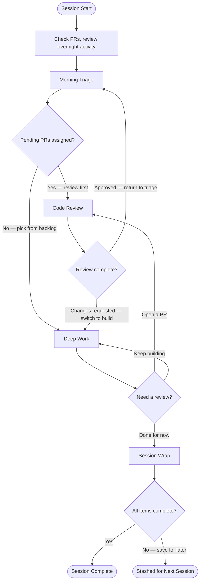

# Developer Triage — Decision Map

```mermaid
flowchart TD
    START(["Session Start"]) --> ENTRY["Check PRs, review overnight activity"]

    ENTRY --> TRIAGE["Morning Triage"]
    TRIAGE --> BRANCH1{"Pending PRs assigned?"}
    BRANCH1 -->|"Yes — review first"| PR_REVIEW["Code Review"]
    BRANCH1 -->|"No — pick from backlog"| DEEP_WORK["Deep Work"]

    PR_REVIEW --> BRANCH2{"Review complete?"}
    BRANCH2 -->|"Approved — return to triage"| TRIAGE
    BRANCH2 -->|"Changes requested — switch to build"| DEEP_WORK

    DEEP_WORK --> BRANCH3{"Need a review?"}
    BRANCH3 -->|"Open a PR"| PR_REVIEW
    BRANCH3 -->|"Keep building"| DEEP_WORK
    BRANCH3 -->|"Done for now"| WRAP["Session Wrap"]

    WRAP --> EXIT{"All items complete?"}
    EXIT -->|"Yes"| DONE(["Session Complete"])
    EXIT -->|"No — save for later"| SAVED(["Stashed for Next Session"])
```
