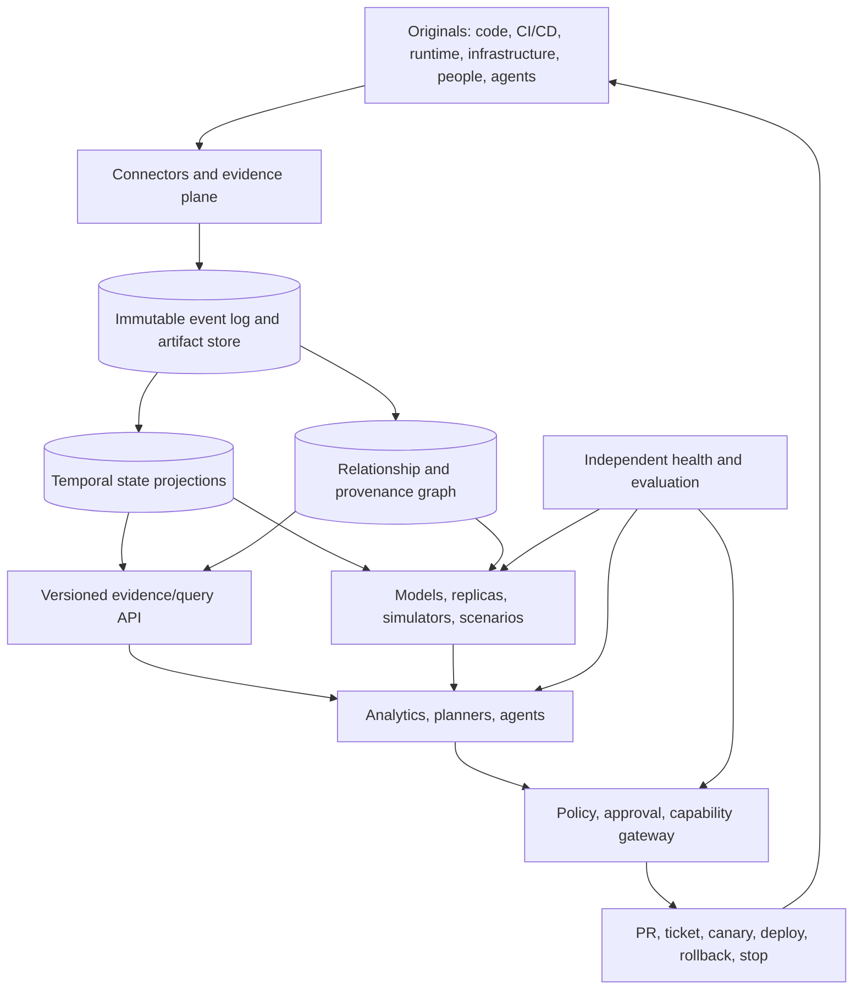

# Digital Twin: architecture and federation

## Design stance

Design from a decision and its risk boundary outward. A twin universe should be a federation of purpose-bounded component twins, not a monolithic graph or universal database. Each component owns reconciliation with its original and publishes scoped claims, capabilities, freshness, validity, and authority.

## Reference architecture



## Layer contracts

1. **Identity and definitions:** Stable identifiers for originals, types, instances, revisions, artifacts, models, agents, policies, scenarios, decisions, and actions. Definitions are versioned separately from instance state.
2. **Evidence and synchronization:** Source-specific connectors emit immutable envelopes with source identity, event time, ingestion time, sequence/revision, schema version, producer, sensitivity, integrity, and raw-evidence reference. Support snapshots and reconciliation in addition to streams.
3. **Temporal state and thread:** Keep immutable history and materialized views. Support as-of queries and deterministic replay. Every decision-critical field and edge carries provenance, transformation, freshness, validity interval, confidence, and authority.
4. **Topology and composition:** Model typed relationships among product, code, build, deployment, runtime, infrastructure, people, agents, policies, incidents, and outcomes. A graph is a projection over evidence, not the sole source of truth.
5. **Models and scenarios:** Register mechanistic, statistical, causal, queueing, policy, executable, and learned models independently. Composition requires explicit adapters and uncertainty propagation.
6. **Decision and action:** Queries return snapshot watermark, versions, freshness, validity domain, provenance, uncertainty, and explicit `unknown`. Agents usually emit proposals and evidence packets. Actions require deterministic policy evaluation and reconciliation.
7. **Independent assurance:** Health, evaluation, and audit paths must be able to disagree with the twin and must not be graded by the same model/action loop.

## Component-twin manifest

Each federated twin should publish:

```yaml
id: twin:example/service
definition: service-twin@2
original: service:example
owner: team@example
purpose: change-impact and rollback recommendation
source_authority:
  - id: runtime-feed
    contract: runtime-feed@4
    freshness: 30s
  - id: deploy-feed
    contract: deploy-feed@2
    freshness: 5m
time_basis: UTC
sync_contract:
  mode: event-driven
  decision_critical_max_age: 30s
  reconciliation: hourly
validity_domain:
  environments: [production]
  regions: [us-east]
  versions: [service@current]
  excluded_conditions: []
queries: [state, dependencies, change-impact]
models: [impact-model@7]
scenarios: [rollback-replay@1]
actions: [recommend-rollback]
authority: shadow
sensitivity: confidential
retention: operational-evidence-90d
stop_authority: team@example
retirement_endpoint: registry://twins/example/service/retire
notes: recommendation only; no direct rollback authority
```

Treat this as a contract pattern, not a universal standard schema.

## Federation rules

- Local owners retain authority over source reconciliation and model validity.
- A catalog resolves identities, capabilities, versions, and compatibility without centralizing all sensitive payloads.
- Scenario composition freezes snapshots, model versions, seeds/configuration, policy context, and uncertainty.
- Cross-twin edges are signed or otherwise attributable and have validity intervals.
- Conflicting claims remain visible; do not silently collapse them into a “current” value.
- A downstream twin may consume a claim only within the producer’s declared validity and authority scope.

## Architectural tradeoffs

| Choice | Default | Why |
|---|---|---|
| Event log plus projections vs graph-only | Event log plus projections | Replay, audit, temporal state, and correction remain possible |
| Federation vs central universe | Federation with a minimal catalog | Limits coupling, privacy concentration, and cascading failure |
| Standard ontology vs adapters | Standardize identity/provenance core; adapt domain detail | Prevents lowest-common-denominator semantics |
| High-fidelity replica vs cheap emulator | Fidelity proportional to decision risk | Calibration is expensive and incomplete external behavior is common |
| Continuous synchronization vs declared frequency | Declared frequency per field/use case | “Real time” is not one universal requirement |
| Bidirectional control vs recommendation | Earn authority gradually | A return path turns the twin into a control system |

## Failure modes to design against

Stale state presented as current; duplicate or reordered events; untracked manual changes; hidden schema changes; name-based identity collisions; graph contamination; false causal inference; simulator exploitation; correlated agent/verifier failures; centralized compromise; and irreversible action without current preconditions.

## Sources

- NISTIR 8356: https://csrc.nist.gov/pubs/ir/8356/final
- NIST Digital Twins for Advanced Manufacturing: https://www.nist.gov/programs-projects/digital-twins-advanced-manufacturing
- Digital Twins for Software Engineering Processes: https://arxiv.org/html/2510.05768v1
- Digital Twin Consortium digital thread: https://www.digitaltwinconsortium.org/initiatives/the-definition-of-digital-thread/
- FMI 3.0: https://www.fmi-standard.org/docs/3.0/
- OPC UA reference: https://reference.opcfoundation.org/
- Istio traffic mirroring: https://istio.io/latest/docs/tasks/traffic-management/mirroring/
