# Architecture Overview

This document describes the architecture, data flow, and key components of the agent-skills repository.

## Repository Structure

```mermaid
graph TD
    subgraph "Repository Root"
        AGENTS[AGENTS.md<br/>Agent Instructions]
        README[README.md<br/>Skill Index]
        CONTRIB[CONTRIBUTING.md<br/>Contribution Guide]
        PYT[pyproject.toml<br/>Tool Configs]
        REQ[requirements-dev.txt<br/>Dev Dependencies]
    end

    subgraph "Core Scripts"
        VS[validate-skills.rb<br/>Skill Format Validator]
        VSQ[validate-skill-quality.rb<br/>Quality Validator]
        EV[validate-evals.py<br/>Eval Manifest Validator]
        EVV[eval_validation.py<br/>Shared Validation Logic]
        EC[eval-coverage.py<br/>Coverage Reporter]
        TEC[test-eval-coverage.py<br/>Coverage Tests]
        TEV[test-eval-validation.py<br/>Validation Tests]
        CA[check-artifacts.py<br/>Artifact Freshness]
        GEN[gen-*.rb<br/>Catalog Generators]
        LOG[logging_utils.py<br/>Structured Logging]
        STD[scan-tech-debt.py<br/>Debt Scanner]
        VAM[validate-agents-md.py<br/>AGENTS.md Validator]
    end

    subgraph "CI/CD"
        WF[validate.yml<br/>GitHub Actions]
        PC[.pre-commit-config.yaml<br/>Pre-commit Hooks]
    end

    subgraph "Skills Directory"
        SK1[skill-name/<br/>SKILL.md + README.md]
        SK2[skill-name/<br/>references/ templates/ scripts/]
        EVALS[evals/<br/>evals.json]
    end

    subgraph "Generated Artifacts"
        MP[.claude-plugin/<br/>marketplace.json]
        CP[.codex-plugin/<br/>plugin.json]
        LLM[llms.txt]
    end

    subgraph "Bundles"
        BND[Bundle umbrellas<br/>Multi-skill compositions]
    end

    AGENTS --> VS
    AGENTS --> WF
    README --> SK1
    CONTRIB --> PYT
    PYT --> WF
    REQ --> WF

    WF --> VS
    WF --> VSQ
    WF --> EV
    WF --> EC
    WF --> CA
    WF --> STD
    WF --> VAM

    VS --> SK1
    VSQ --> SK1
    EV --> EVV
    EV --> EVALS
    EC --> EVV
    CA --> MP
    CA --> CP
    CA --> LLM
    GEN --> MP
    GEN --> CP
    GEN --> LLM

    TEC --> EC
    TEV --> EVV
    LOG --> STD
    LOG --> VAM
```



## Data Flow

### 1. Contribution Flow
Developer creates/modifies skill → Pre-commit hooks run → PR triggers CI → Validators check format/quality/evals → Generated artifacts verified → Merge to main.

### 2. Validation Pipeline
```
SKILL.md + README.md + evals/evals.json
       │
       ▼
validate-skills.rb ──────► Structural validation (dirs, links, format)
       │
       ▼
validate-skill-quality.rb ► Semantic validation (descriptions, triggers)
       │
       ▼
validate-evals.py ────────► Eval manifest schema validation
       │
       ▼
eval-coverage.py ─────────► Coverage reporting + ratchet enforcement
```

### 3. Generated Artifact Pipeline
```
Skill directories (SKILL.md frontmatter)
       │
       ├──► gen-claude-marketplace.rb  → .claude-plugin/marketplace.json
       ├──► gen-codex-plugin.rb        → .codex-plugin/plugin.json
       └──► gen-llms-txt.rb            → llms.txt
```

## Key Components

| Component | Language | Purpose |
|-----------|----------|---------|
| `validate-skills.rb` | Ruby | Structural skill format validation |
| `validate-skill-quality.rb` | Ruby | Semantic quality validation |
| `eval_validation.py` | Python | Shared eval manifest validation |
| `eval-coverage.py` | Python | Eval coverage reporting + ratchet |
| `check-artifacts.py` | Python | Generated artifact freshness check |
| `logging_utils.py` | Python | Structured logging with PII redaction |
| `scan-tech-debt.py` | Python | Technical debt marker scanning |

## External Dependencies

This repository has no runtime service dependencies. It is a static skills repository with:
- **GitHub Actions** for CI/CD validation
- **PyPI** packages (ruff, mypy, pytest, radon, deptry, bandit, loguru) for code quality
- **Ruby gems** (standard library) for skill validation scripts
- No databases, caches, message queues, or external APIs at runtime
