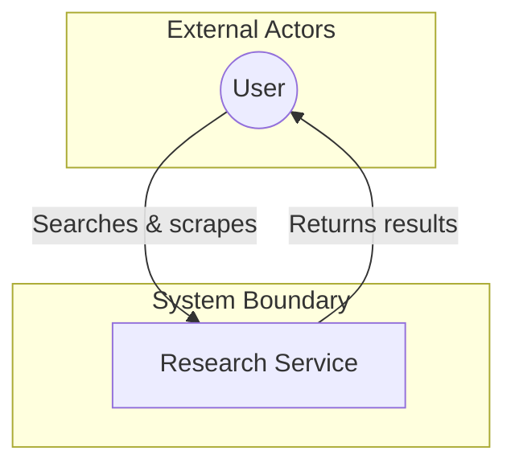
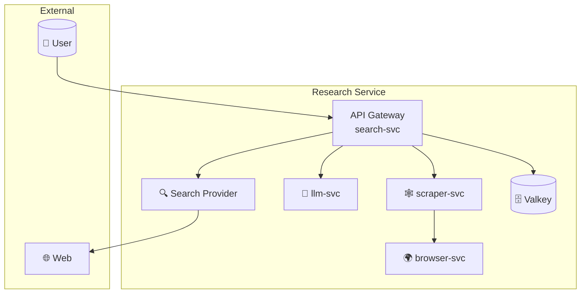
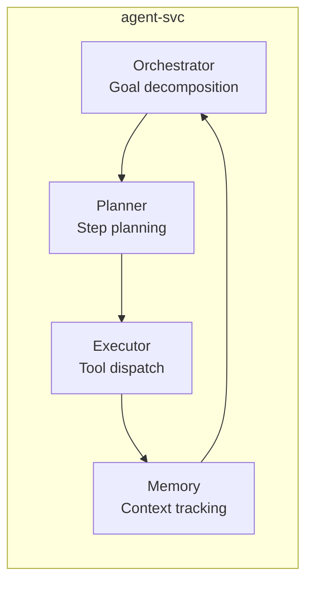

# Rendering a Chosen C4 View with Mermaid

This reference does not choose the C4 level, model elements, boundaries, or relationships. Make those decisions with `c4-diagramming`, then use this reference to render the resulting view on a Mermaid-compatible surface.

Mermaid does not have stable native C4 syntax. `C4Context` and `C4Container` are experimental and unreliable across common renderers. For a durable C4 model and Structurizr workflow, return to `c4-diagramming`. For inline Markdown where only standard Mermaid renders, use the flowchart approximation below.

## Flowchart Workaround for Inline Markdown

Use Mermaid flowchart subgraphs and styling to represent only the elements and relationships in the already-chosen C4 view. Do not infer a level, add architecture content, or redefine a boundary while converting it.

### System Context (L1)

### Container Diagram (L2) — Multi-service stack

### Component Diagram (L3) — Inside a service

## Limitations

- No native C4 shapes (person, system, container, database) — must approximate with subgraphs
- No automatic layout — manual positioning via subgraph nesting
- No relationship descriptions on edges (can add via edge labels)
- Use `c4-diagramming` for C4 modeling and Structurizr decisions. Use Mermaid flowchart approximations only to render an already-chosen view when the target surface requires standard Mermaid.
